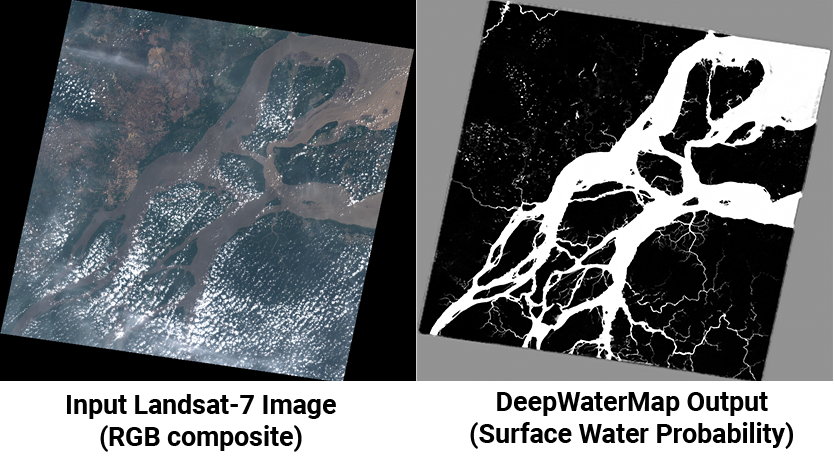

# DeepWaterMap
- **DeepWaterMap** is a **deep convolutional neural network trained to segment surface water on multispectral imagery**. 
- This is work is a reimplementation of work done by [**Leo F. Isikdogan**](https://github.com/isikdogan/deepwatermap)




## Dependencies
- **TensorFlow** (tested on TensorFlow 1.12)
- **Numpy**
- **Tifffile** (for reading geotiff files)
- **OpenCV** (for reading and writing images)

Dependencies can be installed using the Python Package Installer (pip):

```
pip install tensorflow==1.12.0 tifffile opencv-python
```

## Running inference

You can use our inference script to generate a surface water map given a multi-spectral image as:
```
$ python inference.py --checkpoint_path checkpoints/cp.135.ckpt \
    --image_path sample_data/sentinel2_example.tif --save_path water_map.png
```

- You can download the checkpoint that contains our trained model parameters at:
[**checkpoints.zip**](https://utexas.app.box.com/s/j9ymvdkaq36tk04be680mbmlaju08zkq/file/565662752887).

- You can find Sample Input images at: [**sample_data.zip**](https://utexas.app.box.com/s/j9ymvdkaq36tk04be680mbmlaju08zkq/file/565677626152).

- DeepWaterMap does not require the input images to be Landsat-7, Landsat-8, or Sentinel-2 images. However, it expects the input bands to approximately match the Landsat bands listed below.

```
B2: Blue
B3: Green
B4: Red
B5: Near Infrared (NIR)
B6: Shortwave Infrared 1 (SWIR1)
B7: Shortwave Infrared 2 (SWIR2)
```

## Dataset

- You do not need to download the dataset to use DeepWaterMap to run inference on images. You can use the [**checkpoint**](https://utexas.app.box.com/s/j9ymvdkaq36tk04be680mbmlaju08zkq/file/565662752887) we provide instead.

> We provide the original GeoTIFF files and the compressed TFRecords dataset that we used to train DeepWaterMap.

- If you wish to re-train our model or train another model using our dataset you can download our TFRecords dataset and run ```trainer.py```.

- [**Download TFRecords (~205GB)**](https://utexas.app.box.com/s/j9ymvdkaq36tk04be680mbmlaju08zkq/folder/94459511962)

> You can find the  original GeoTIFF images in the following box folder.
- [**Original GeoTIFF files (~1TB)**](https://utexas.app.box.com/s/j9ymvdkaq36tk04be680mbmlaju08zkq/folder/94459536870)
- The GeoTIFF dataset is very big. If you need to find and download a particular tile you can find an index of the tiles in ShapeFile format in [**metadata.zip**](https://utexas.app.box.com/s/j9ymvdkaq36tk04be680mbmlaju08zkq/file/564393935179).


## Papers

* L. F. Isikdogan, A.C. Bovik, and P. Passalacqua, "Seeing Through the Clouds with DeepWaterMap," *IEEE Geoscience and Remote Sensing Letters*, 2019. [[**Read at IEEExplore**]](https://ieeexplore.ieee.org/document/8913594), [[**PDF**]](http://www.isikdogan.com/files/isikdogan2019_deepwatermap_v2.pdf)
* F. Isikdogan, A.C. Bovik, and P. Passalacqua, "Surface Water Mapping by Deep Learning," *IEEE Journal of Selected Topics in Applied Earth Observations and Remote Sensing*, 2017. [[**Read at IEEExplore**]](https://ieeexplore.ieee.org/document/8013683/), [[**PDF**]](http://www.isikdogan.com/files/isikdogan2017_deepwatermap.pdf)
