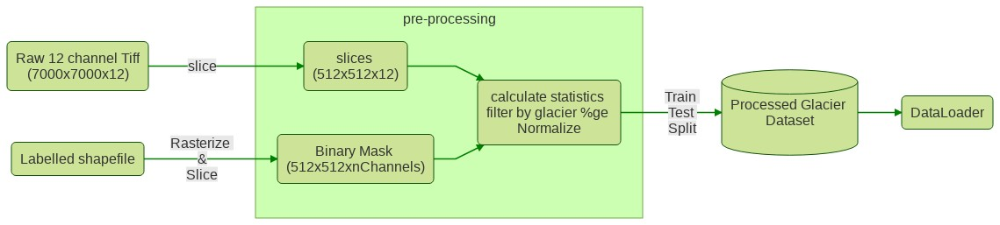

# Glacier Mapping From Satellite Imagery

## Overview
The goal of this project is to use **U-Net to automatically segment
debris and ice glaciers from satellite images**.

## Results


## Pipeline

### Overview

The full preprocessing and training can be viewed at
`https://colab.research.google.com/drive/12P6lmHrTDaIEQ06M08_-4V0PVQ9Gz0mT#scrollTo=2Gukuvq1gx37`
Besides the raw tiffs and shapefiles, the required inputs are,

* `conf/masking_paths.yaml`: Says how to burn shapefiles into image masks.
* `conf/postprocess.yaml`: Says how to filter and transform sliced images.
* `conf/train.yaml`: Specifies training options.

At each step, the following intermediate files are created,
* `generate_masks()` --> writes mask_{id}.npy's and mask_metadata.csv
* `write_pair_slices()` --> writes slice_{tiff_id}_img_{slice_id}, slice_{tiff_id}_label_{slice_id}, and slice_0-100.geojson (depending on which lines from mask_metadata are sliced)
* `postproces()` --> copies slices*npy from previous step into train/, dev/, test/ folders, and writes mean and standard deviations to path specified in postprocess.yaml
* `glacier_mapping.train.*` --> creates data/runs/run_name folder, containing logs/ with tensorboard logs and models/ with all checkpoints




## Requirements
- Requirements are specified in `requirements.txt`. The full package sources is
available in the `glacier_mapping` directory. 

## Dataset
- Raw training data are **Landsat 7 tiff images from the Hindu-Kush-Himalayan region**. 
- This study works on the **regions of Bhutan and Nepal**. 
- Shapefile labels of the glaciers are provided by [**ICIMOD**](https://www.icimod.org)

### Data Preprocessing:

1. **Slicing**: We slice the input tiffs into 512x512 tiles. The resulting tiles
    along with corresponding shapefile labels are stored. Metadata of the slices
    are stored in a geojson file" ```slicemetadata.geojson``` To slice, ```run:
    python3 src/slice.py```
2. **Transformation**: For easy processing, we convert the input image and
   labels into multi-dimensional numpy ``.npy`` files.
3. **Masking**: The input shapefiles are transformed into masks. The masks are
    needed for use as labels. This involves transforming the label as
    multi-channel images with each channel representing a label class ie. 0 -
    Glacier, 1 debris etc To run transformation and masking: ```python3
    src/mask.py```

### Data PostProcessing
1. **Filtering**: Returns the paths for pairs passing the filter criteria for a
   specific channel. Here we filter by the percentage of 1's in the filter
   channel.
2. **Random Split**: The final dataset is saved in three folders: ``train/ test/
   dev/``
3. **Reshuffle**: Shuffle the images and masks in the output directory
4. **Imputation**: Given and input, we check for missing values (NaNs) and
   replace with 0
5. **Generate stats**: Generate statistics of the input image channels: returns
   a dictionary with keys for means and standard deviations accross the channels
   in input images.
6. **Normalization**: We normalize the final dataset based on the means and
   standard deviations calclualted.


### Vector Data Sources
Labels : [ICIMOD](http://www.icimod.org/)

* [**2000, Nepal**](http://rds.icimod.org/Home/DataDetail?metadataId=9351&searchlist=True): Polygons older/newer than 2 years from 2000 are filtered out. Original collection contains few polygons from 1990s
* [**2010, Nepal**](http://rds.icimod.org/Home/DataDetail?metadataId=9348&searchlist=True): Polygons older/newer than 2 years from 2010 are filtered out. Original collection is for 1980-2010
* [**2000, Bhutan**](http://rds.icimod.org/Home/DataDetail?metadataId=9357&searchlist=True)
* [**2010, Bhutan**](http://rds.icimod.org/Home/DataDetail?metadataId=9358&searchlist=True)

## Model Training
- [**U-Net**](https://arxiv.org/abs/1505.04597) with **dropout (default dropout rate is 0.2)**.


## Inspiration

- This is the reimplementation of workdone by **Kris Sankaran**.

