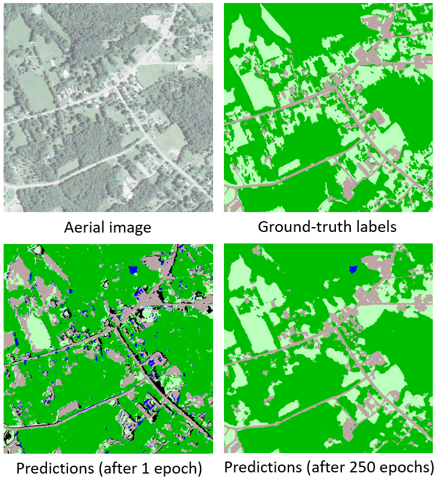

# Azure's Pixel Level Land cover Classification

- This repository contains a tutorial illustrating how to create a deep neural network model that accepts an aerial image as input and returns a land cover label (forested, water, etc.) for every pixel in the image. Microsoft's [Cognitive Toolkit (CNTK)](https://www.microsoft.com/en-us/cognitive-toolkit/) is used to train and evaluate the model on an [Azure Geo AI Data Science Virtual Machine](http://aka.ms/dsvm/GeoAI) or an [Azure Batch AI](https://docs.microsoft.com/azure/batch-ai/) GPU cluster. The method shown here was developed in collaboration between the [Chesapeake Conservancy](http://chesapeakeconservancy.org/), [ESRI](https://www.esri.com), and [Microsoft Research](https://www.microsoft.com/research/) as part of Microsoft's [AI for Earth](https://www.microsoft.com/en-us/aiforearth) initiative.

- This is a step-by-step approach for re-implemention this [**work**](https://github.com/Azure/pixel_level_land_classification)

## Sample Output

- This tutorial will train a pixel-level land cover classifier for a single epoch: your model will produce results similar to bottom-left. By expanding the training dataset and increasing the number of training epochs, we achieved results like the example at bottom right. The trained model is accurate enough to detect some features, like the small pond at top-center, that were not correctly annotated in the ground-truth labels.

## How to Get Started

The training and evaluation steps of this tutorial can be performed on either:
- an Azure Geo AI Data Science VM
    - Train a model on a data sample using Jupyter notebooks
    - Deploy the trained model directly in ESRI's ArcGIS Pro
- an Azure Batch AI GPU cluster
    - Set up your cluster and submit jobs to it from your command line
    - Learn how to scale to large clusters for faster training on larger datasets
    - (Optional) After training, you may download your model and deploy it in ArcGIS Pro on a Geo AI DSVM (see [provisioning instructions](./geoaidsvm/setup.md) to get started)

| Geo AI DSVM | Batch AI |
|-------------|----------|
| [Create a Geo AI Data Science VM](./geoaidsvm/setup.md) | [Create a Batch AI cluster](./batchai/setup.md) |
| [Train a model in a Jupyter notebook](./geoaidsvm/02_Train_a_land_classification_model_from_scratch.ipynb) | [Train a model on the Batch AI cluster](./batchai/train.md) |
| [Evaluate the model using a Jupyter notebook](./geoaidsvm/03_Apply_trained_model_to_new_data.ipynb) | [Evaluate the model using a GPU cluster](./batchai/evaluate.md) |
| [Deploy your model in ArcGIS Pro](./geoaidsvm/04_Apply_trained_model_in_ArcGIS_Pro.ipynb) | [Learn how to scale up training](./batchai/scaling.md) |

## Related materials

- [Keynote demo from Microsoft Ignite](https://www.youtube.com/watch?time_continue=1&v=MUqo-lsAKgQ#t=23m46s)
- [Blog post](https://blogs.technet.microsoft.com/machinelearning/2018/03/12/pixel-level-land-cover-classification-using-the-geo-ai-data-science-virtual-machine-and-batch-ai/)
- Main [AI for Earth](https://www.microsoft.com/en-us/aiforearth) website
- [Publicity video on the Chesapeake Conservancy collaboration with Microsoft](http://chesapeakeconservancy.org/2017/07/10/microsoft-video-features-chesapeake-conservancy/)
- [Video clip showing real-time local application of the trained CNTK model through ESRI's ArcGIS software](https://www.youtube.com/watch?v=_iq-_K1OsMA)
- Geo AI DSVM [product page](http://aka.ms/dsvm/GeoAI) and [documentation](http://aka.ms/dsvm/GeoAI/docs)

