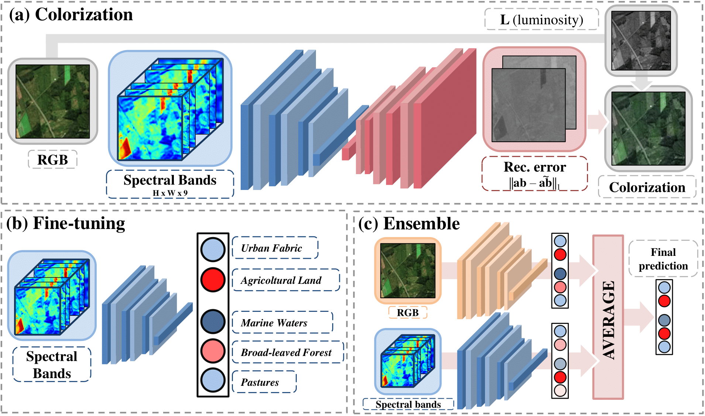

# The color out of space: learning self-supervised representations for Earth Observation imagery
- This repository contains the  reimplementation of the PyTorch code for the paper:
**<a href="https://arxiv.org/abs/2006.12119">The color out of space: learning self-supervised representations for Earth Observation imagery</a>**  

## Model architecture


## Prerequisites
* **Python >= 3.7**
* **PyTorch >= 1.5**
* **CUDA 10.0**

## Dataset
- **BigEarth Dataset** - [Download Link](https://bigearth.net)
- It is a *large-scale Sentinel-2 benchmark archive, consisting of 590,236 Sentinel-2 image patches*.

## Models
### Colorization
Different Encoder-Decoder combinations are available
- *Encoder ResNet18 - Decoder ResNet18*
- *Encoder ResNet50 - Decoder ResNet50*
- *Encoder ResNet50 - Decoder ResNet18*
### Multi Label Classification
The same encoders were employed in the colorization phase and an Ensemble model, composed of two equal encoders trained respectively on RGB and all other bands.

## Training 
Before running the files ``main.py`` contained in both the ``Colorization`` and ``Multi_label_classification`` folders you can set the desired parameters in the file ``job_config.py``, which modify the ones contained in ``config/configuration.json``.

## Cite

```bibtex
  @inproceedings{vincenzi2020color,
  title={The color out of space: learning self-supervised representations for Earth Observation imagery},
  author={Vincenzi, Stefano and Porrello, Angelo and Buzzega, Pietro and Cipriano, Marco and Pietro, Fronte and Roberto, Cuccu and 
          Carla, Ippoliti and Annamaria, Conte and Calderara, Simone},
  booktitle={25th International Conference on Pattern Recognition},
  year={2020}
}
```
