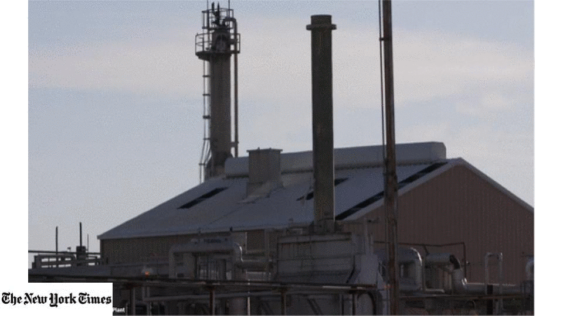

## Methane Detection from Hyperspectral-Imagery

- This repo is the reimplementaion of the paper [**Deep Remote Sensing Methods for Methane Detection in Overhead Hyperspectral Imagery**](https://openaccess.thecvf.com/content_WACV_2020/papers/Kumar_Deep_Remote_Sensing_Methods_for_Methane_Detection_in_Overhead_Hyperspectral_WACV_2020_paper.pdf)
- This paper proposes **H-MRCNN(Hyperspectral Mask-RCNN)** which introduces fast algorithms to **analyze large-area hyper-spectral information and methods to autonomously represent and detect CH4 plumes**. This repo contains 2 methods for processing different type of data, **Single detector works on 4-channels data and Ensemble detectors** works on **432-channels raw hyperspectral data recorded from AVIRIS-NG** instrument. 

## Working Overview
<p align="center">

<p>

## Requirements
- Linux or MacOS with Python ≥ 3.6
- Tensorflow <= 1.8
- CUDA 9.0
- cudNN (compatible to CUDA)

## Installation
1. Clone this repository
2. Install dependencies
```
pip install -r requirements.txt
```
#### Single-detector
Running single-detector is quite simple. Follow the [README.md](https://github.com/satish1901/Methane-detection-from-hyperspectral-imagery/blob/master/single_detector/README.md) in single_detector folder
```
single_detector/README.md
```

#### Ensemble-detector
For Running ensemble-detector we need some pre-processing. Follow the [README.md](https://github.com/satish1901/Methane-detection-from-hyperspectral-imagery/blob/master/ensemble_detectors/README.md) in emsemble_detector folder
```
ensemble_detector/README.md
```


## Citing
If this work is useful to you, please consider citing our paper:
```
@inproceedings{kumar2020deep,
  title={Deep Remote Sensing Methods for Methane Detection in Overhead Hyperspectral Imagery},
  author={Kumar, Satish and Torres, Carlos and Ulutan, Oytun and Ayasse, Alana and Roberts, Dar and Manjunath, BS},
  booktitle={2020 IEEE Winter Conference on Applications of Computer Vision (WACV)},
  pages={1765--1774},
  year={2020},
  organization={IEEE}
}
```


