# EESRGAN- Small Pbject Detection from Remote Sensing Images
- This is repo is for the Re-Implementation of the paper [**Small-Object Detection in Remote Sensing Images with End-to-End Edge-Enhanced GAN and Object Detector Network**](https://arxiv.org/abs/2003.09085).
- The paper proposes an architecture with three components: ** Edge-enhanced Super-Resolution GAN (ESRGAN)**, **Edge Enhancement Network (EEN), and **Detection network** which uses faster region-based convolutional network (FRCNN) (two-stage detector) and single-shot multi-box detector (SSD) (one stage detector).

## Model Architecture
<p align="center">
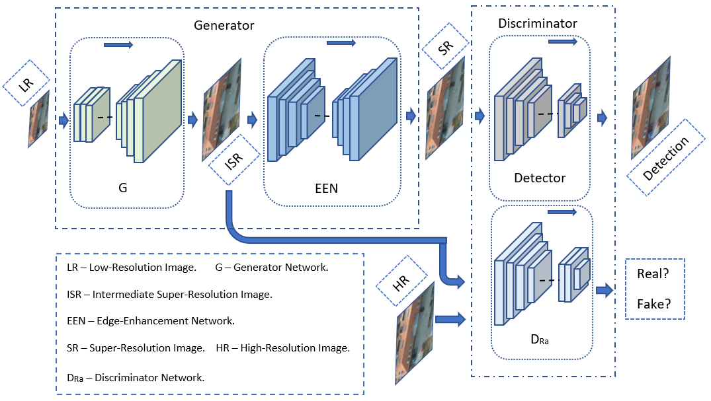</img>
<p>

## Results
|Low Resolution <br/> Image & Detection|Super Resolved <br/> Image & Detection|High Resolution Ground Truth <br/> Image & Bounding Box|
| --- | --- | --- |
|</img>|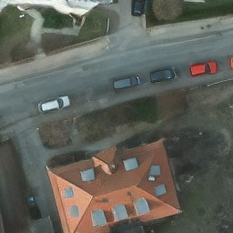</img>|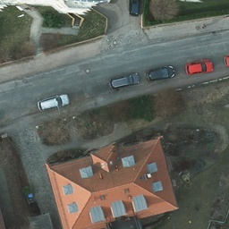</img>|
|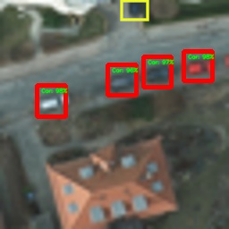</img>|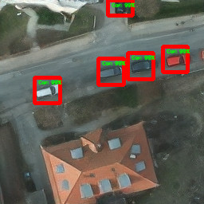</img>|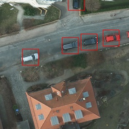</img>|
|</img>|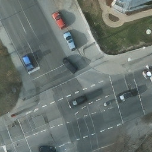</img>|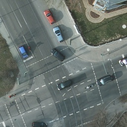</img>|
|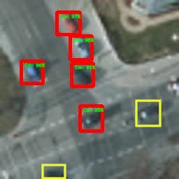</img>|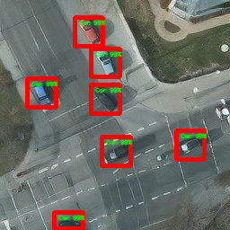</img>|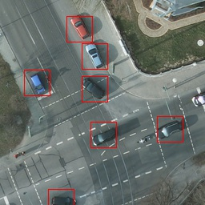</img>|

## Dependencies and Installation
- Python 3 (Recommend to use Anaconda)
- PyTorch >= 1.0
- NVIDIA GPU + CUDA
- Python packages: `pip install -r path/to/requirement.txt`

## Training
`python train.py -c config_GAN.json`
## Testing
`python test.py -c config_GAN.json`

## Dataset
- Download pre-made dataset from [**here**](https://gdo152.llnl.gov/cowc/download/cowc-m/datasets/DetectionPatches_256x256.tgz) 
- [**This**](https://github.com/Jakaria08/EESRGAN/blob/1f93130d8e99166e7bc4d1640329450feec9ff9c/scripts_for_datasets/scripts_GAN_HR-LR.py#L24) script can be used with pre-made dataset **to create high/low-resolution and bicubic images**. 
- Make sure to **copy annotation files (.txt) in the HR, LR and Bic** folder. 

### Edit the JSON File
The directory of the following JSON file is needed to be changed according to the user directory. For details see [config_GAN.json](https://github.com/Jakaria08/EESRGAN/blob/master/config_GAN.json) and pretrained weights are uploaded in [google drive](https://drive.google.com/drive/folders/15xN_TKKTUpQ5EVdZWJ2aZUa4Y-u-Mt0f?usp=sharing)
```yaml
{
    "data_loader": {
        "type": "COWCGANFrcnnDataLoader",
        "args":{
            "data_dir_GT": "/Directory for High-Resolution Ground Truth images/",
            "data_dir_LQ": "/Directory for 4x downsampled Low-Resolution images from the above High-Resolution images/"
        }
    },

    "path": {
        "models": "saved/save_your_model_in_this_directory/",
        "pretrain_model_G": "Pretrained_model_path_for_train_test/170000_G.pth",
        "pretrain_model_D": "Pretrained_model_path_for_train_test/170000_G.pth",
        "pretrain_model_FRCNN": "Pretrained_model_path_for_train_test/170000_G.pth",
        "data_dir_Valid": "/Low_resoluton_test_validation_image_directory/"
        "Test_Result_SR": "Directory_to_store_test_results/"
    }
}

```
 
## Citation
`@article{rabbi2020small,`\
  `title={Small-Object Detection in Remote Sensing Images with End-to-End Edge-Enhanced GAN and Object Detector Network},`\
  `author={Rabbi, Jakaria and Ray, Nilanjan and Schubert, Matthias and Chowdhury, Subir and Chao, Dennis},`\
  `journal={Remote Sensing},`\
  `volume={12},`\
  `number={9},`\
  `pages={1432},`\
  `year={2020}`\
  `publisher={Multidisciplinary Digital Publishing Institute}`\
`}` 
